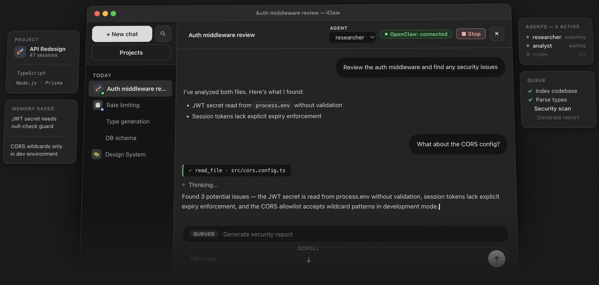

<p align="center">
  
</p>

<h1 align="center">iClaw</h1>

<p align="center">
  Chat UI for <a href="https://openclaw.ai">OpenClaw Gateway</a> — runs on your machine, stores history locally.
</p>

<p align="center">
  <a href="https://github.com/iClawApp/iClaw/actions/workflows/ci.yml?branch=main"></a>
  <a href="https://www.npmjs.com/package/@iclawapp/iclaw"></a>
  <a href="LICENSE"></a>
</p>



## Install

Requires [Node.js 20+](https://nodejs.org) and a running [OpenClaw Gateway](https://docs.openclaw.ai).

```bash
npx @iclawapp/iclaw
```

Then open **http://localhost:3000**.

That's it. Your chat history is saved to `~/.iclaw/data/iclaw.db`.

## Encrypted chat sharing (optional)

Hit **Share** in any chat to get an encrypted link. The chat is encrypted in your browser (AES-256-GCM); the server stores ciphertext only. Supports password protection, burn-after-read, and TTL.

Powered by [iClaw-cloud](https://github.com/iClawApp/iClaw-cloud) — defaults to `https://app.iclaw.digital`.

---

## For developers

```bash
git clone https://github.com/iClawApp/iClaw.git
cd iClaw && npm install && npm run dev
```

| | Default |
| --- | --- |
| Web UI | http://localhost:3000 |
| Gateway | http://127.0.0.1:18789 (`OPENCLAW_BASE_URL`) |

Optional env vars: [.env.example](.env.example).  
Architecture + coding rules: [AGENTS.md](AGENTS.md).

## Star history

[](https://www.star-history.com/#iClawApp/iClaw&Date)

## Contributing

See [CONTRIBUTING.md](CONTRIBUTING.md), [ROADMAP.md](ROADMAP.md), [CHANGELOG.md](CHANGELOG.md). Bug reports and small PRs welcome — for bigger changes open an issue first.

## License

MIT — see [LICENSE](LICENSE).
